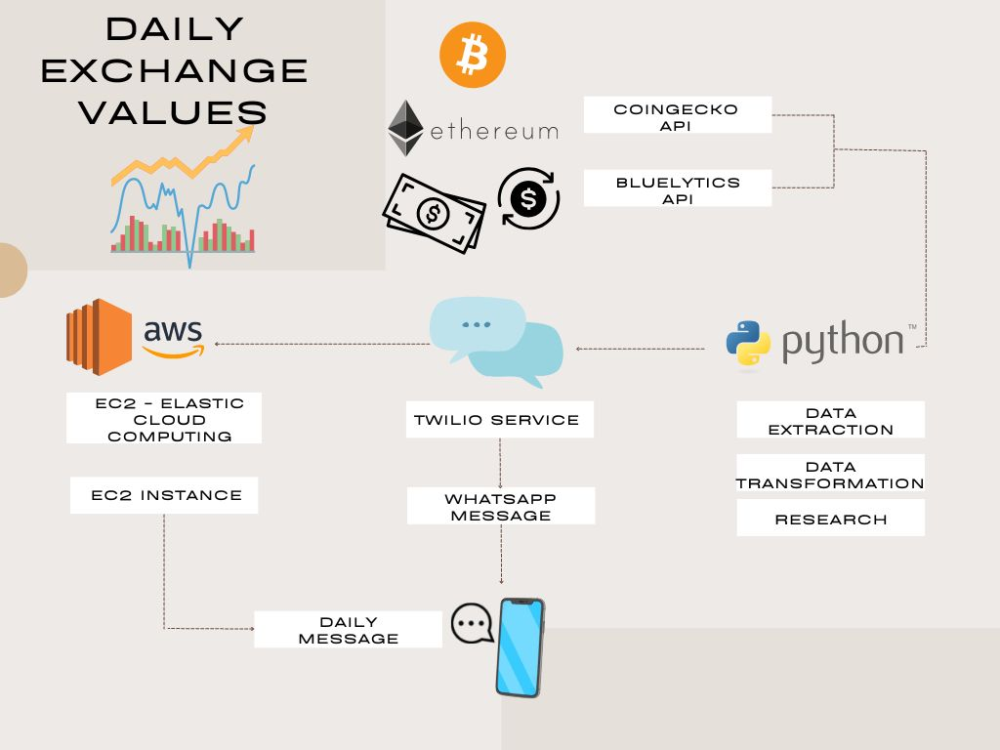
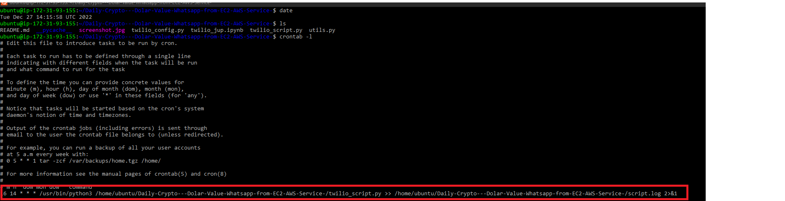
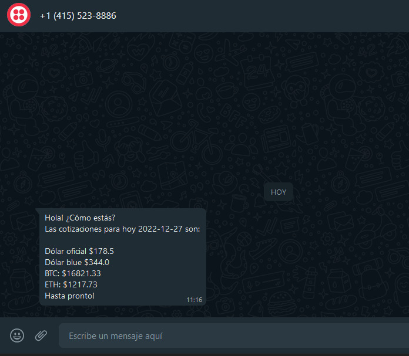

# Daily-Crypto---Dolar-Value-Whatsapp-from-EC2-AWS-Service-

# Introduction
In this project, 2 different APIs are consulted. Different values are extracted and transformed to be sended as a Whatsapp message.
### Python
Then a function is set up to send said information to my number.
### ELASTIC CLOUD COMPUTING - EC2 INSTANCE
An AWS EC2 instance on Ubuntu is then configured to schedule that script to run periodically in the cloud with crontab.

## Whastapp notification from twilio

